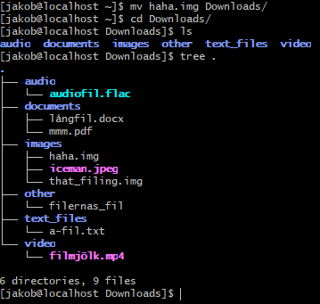
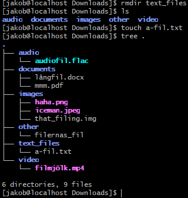
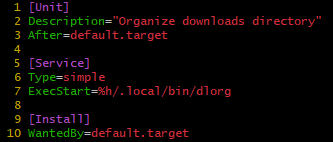

dlorg

dlorg is a program that functions as an organizer for your
downloads directory by monitoring Downloads, and sorting
files into their appropriate subdirectory based on the files extension 
 

in the case that a Downloads subdirectory is deleted, and a file that
would belong to that subdirectory is moved into Downloads, it manages this 
by recreating that subdirectory and moving the file into it, 

to install and run dlorg on startup:

 - git clone git@github.com:jakob778/dlorg_jakob_edberg.git   
 - create a symlink from the repository to your script directory: 
   ln -s "$PWD/dlorg_jakob_edberg/dlorg" ~/.local/bin/dlorg
   
   (or if you prefer, make an absolute path into the repository
   from ExecStart in dlorg.service)

 - go to ~/.config/systemd/user/ and vim/nano dlorg.service and  
 - run: "systemctl --user daemon-reload" for systemd to register the service 
 - run: "systemctl --user enable dlorg.service" to enable dlorg

